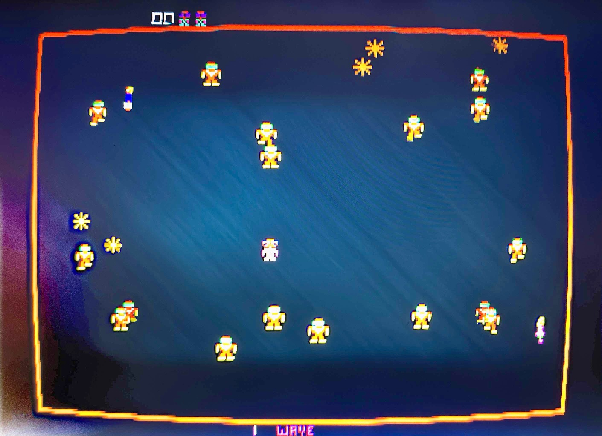
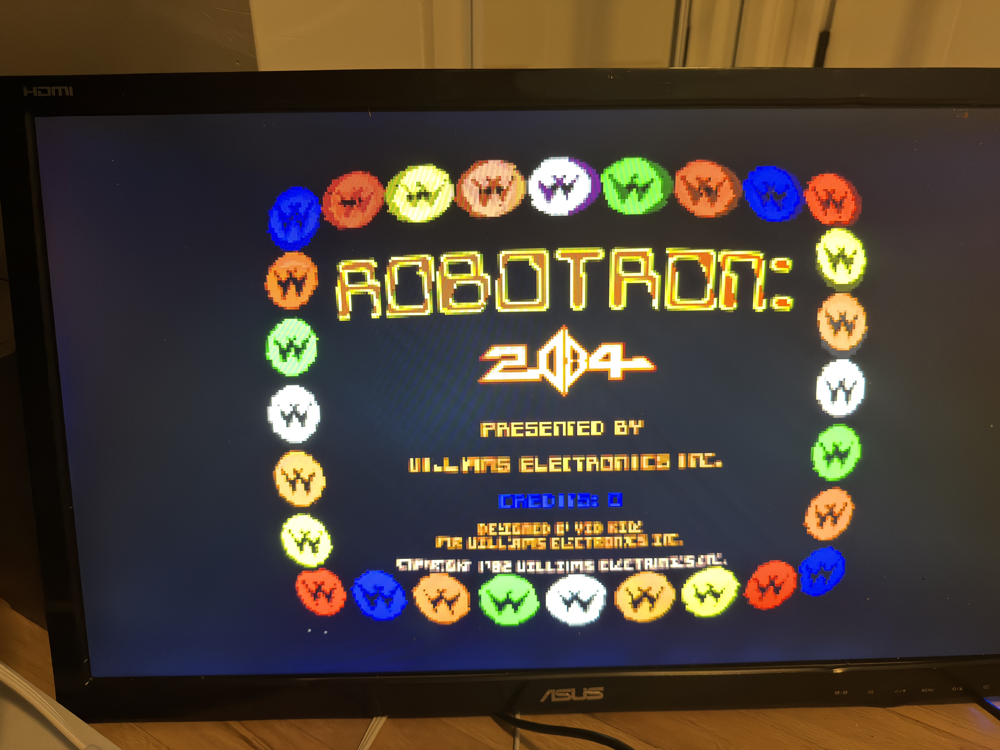
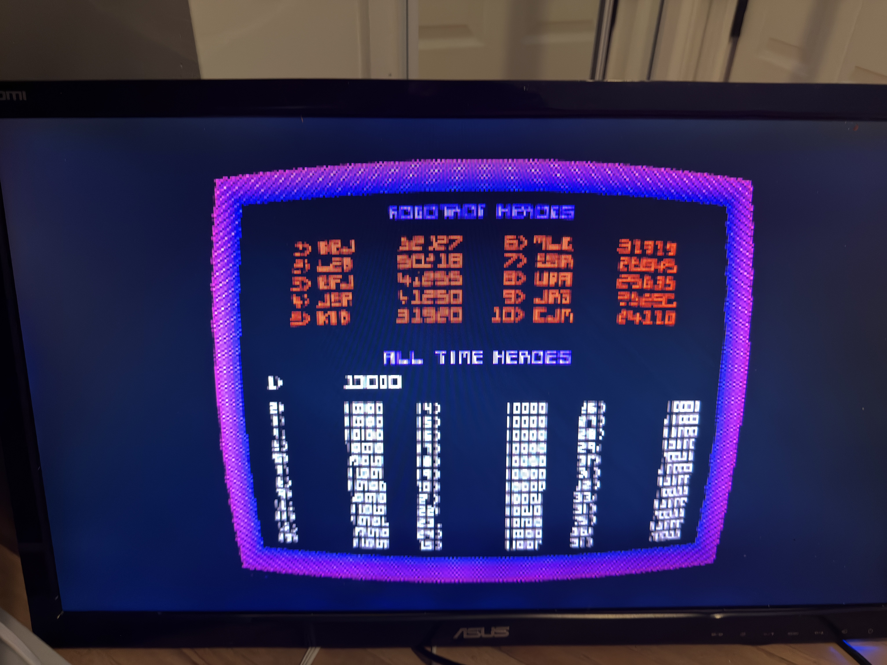
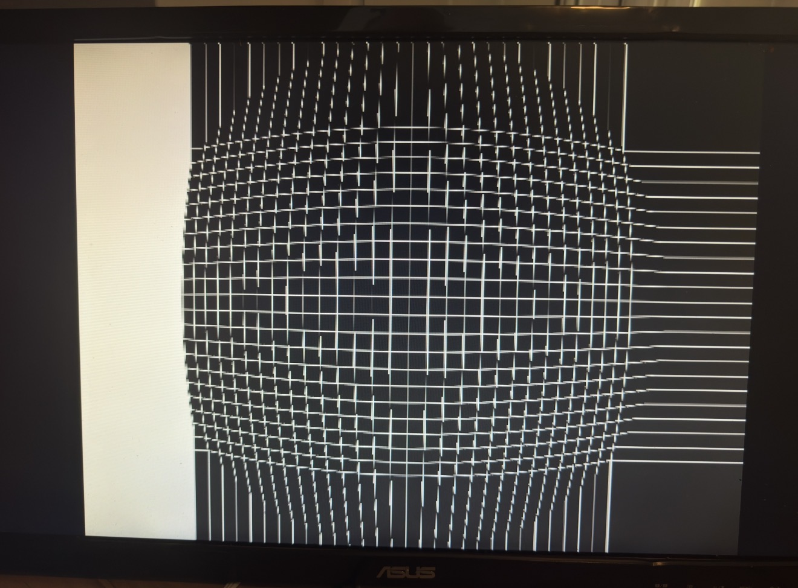

# vis_warp — Games with curved options

A framework-level barrel-distortion video processor for the MiSTer FPGA
platform. Brings CRT-style screen curvature to arcade and console cores —
the warp lives **upstream of the scaler**, so your OSD stays straight, your
integer-scaling and shadowmask/scanline setup still apply, and the bow
scales naturally with whatever HDMI mode you run.

> **On sharpness:** a geometric warp is, by definition, a *resample* — it is
> not bit-for-bit pixel-perfect (any honest CRT-curvature effect resamples).
> vis_warp's sampling is sharpness-tunable: **sharp-bilinear** keeps pixels
> crisp (nearest-neighbor snap with a thin transition band) while keeping
> the curve smooth. Pair with ascal in integer/NN mode for the sharpest
> result. See [`LIMITATIONS.md`](./LIMITATIONS.md) for the honest tradeoff.

```
status:  alpha — barrel + cylindrical warp run on hardware; 1px line-doubling
         is the open blocker (see below), so no build is a polished release yet
target:  Terasic DE10-nano (Cyclone V 5CSEBA6)
quartus: 17.0.2 Lite (free edition)
```

## On hardware — Robotron (first consumer core)



In-game on a DE10-nano over HDMI: the playfield border bows into a barrel and the
corners darken under the vignette — both dialed live from the OSD, and crisp on
the **spherical hi-res 2× engine** (no line-doubling).

| Barrel warp | Warp + CRT shadowmask |
|---|---|
|  |  |

Symmetric barrel across the native 4:3 frame (self-tuning sync-delay), with
the CRT shadowmask stacked downstream so the mask border curves *with* the tube.

> **✅ Shipped — live OSD CRT controls.** Tune **Vert/Horz Bow, Curve Depth and
> Vignette** in real time from the OSD; no firmware, no per-build variants. The
> earlier **line-doubling** of 1-pixel content is fixed by the spherical hi-res 2×
> engine (`MISTER_WARP_HIRES`) — 1px text/lines stay single (details in
> [`LIMITATIONS.md`](./LIMITATIONS.md)).

**▶ Try it (no Quartus):** pre-built core + drop-in MRAs for **6 Williams games**
(Robotron, Joust, Stargate, Bubbles, Splat, Alien Arena)
— [**Robotron-VIS release**](https://github.com/derpyder/Arcade-Robotron_MiSTer-VIS/releases/latest).
Copy the `.rbf` to `_Arcade/cores/`, the `(vis_warp).mra` files to
`_Arcade/`, bring your own MAME ROMs.

Full consumer core + install guide:
[`Arcade-Robotron_MiSTer-VIS`](https://github.com/derpyder/Arcade-Robotron_MiSTer-VIS).
Adopt your own core: [`ADOPTING-A-CORE.md`](./ADOPTING-A-CORE.md).

### Tunable controls — live on the cab

Per-core **OSD sliders**, dialed in real time (CONF_STR → `status[]` →
`VIS_WARP_CURV`/`VIS_WARP_FX` → CDC-synced into the warp). Shipped + HW-validated
on Robotron — no firmware, no per-build variants:

- **CRT Vert Bow** (kv 0–7) · **CRT Horz Bow** (kh 0–7) · **CRT Curve Depth**
  (k, Default = 2) — the barrel geometry, on the **spherical hi-res 2× engine**
  (`MISTER_WARP_HIRES`: warp *and* output at 2× width so the bow stays crisp —
  the line-doubling fix), with sharp-bilinear sampling underneath.
- **CRT Vignette** (0–7) — post-warp radial edge-darkening, a self-contained
  block ([`sys/crt_postfx.v`](./sys/crt_postfx.v)) on the warp's *output* raster
  so it can't touch the geometry. `vignette=0` = transparent passthrough.
- The legacy `cmd 0x45` register path (CDC'd) is retained for a future *global*
  Video Processing menu (shadowmask-style), but the per-core sliders supersede it.

**Attempted + removed:** rounded corners — a raster-anchored mask rounds the black
border, not the warped content, and the content-following variant waved (see
[`LIMITATIONS.md`](./LIMITATIONS.md)). Still on the backlog
([`EFFECTS-BACKLOG.md`](./EFFECTS-BACKLOG.md)): overscan/zoom, pincushion, warped
scanlines (Tier 2); **bloom** (flagship, source-res phosphor glow). All ride on
geometry the warp already computes and stack on top of MiSTer's mask/scanline/gamma.

### Dev rig — the grid test pattern that proves it



The built-in `mycore` test pattern (this fork's upgraded demo core,
selectable patterns in the OSD). A regular grid makes the warp geometry
unambiguous: straight lines bow into a **symmetric** dome, even top-to-
bottom — that's how we validate the self-tuning sync-delay on the dev rig
before any game core touches it. (The flat bars left/right are the 4:3
source letterboxed into 16:9 — ascal's framing, outside the warp.)

---

This is a fork of [`MiSTer-devel/Template_MiSTer`](https://github.com/MiSTer-devel/Template_MiSTer)
with a new framework module added under `sys/`. The fork tracks upstream
HEAD (`f35083f`, 2026-05-13) so future framework updates merge cleanly.
The original upstream README is preserved at
[`README-upstream-template.md`](./README-upstream-template.md).

---

## What it does

vis_warp intercepts a core's video output **before** ascal (MiSTer's
scaler), applies barrel distortion at source resolution, and passes the
warped pixels downstream. The result on screen:

- Each game's pixel art warps as if displayed on a curved CRT.
- ascal's integer scaling preserves the warped image pixel-for-pixel as
  it upscales to your monitor (1080p / 1440p / 4K — same `.rbf` works at
  any output mode).
- The OSD overlay stays straight and readable (it lives downstream of
  the warp).
- Shadowmask + scanlines apply *after* the warp at output resolution —
  matching the correct CRT model: the phosphor mask is on the glass,
  not on the beam.
- v3.1 adds bilinear interpolation, so curves are smooth rather than
  staircased.

It's **macro-gated**. Cores opt in via `MISTER_WARP=1` in their `.qsf`.
By default, the framework behaves identically to upstream Template_MiSTer.

---

## Why this fork exists

MiSTer's framework lives in `Template_MiSTer/sys/`. Each game core
vendors `sys/` into its own bitstream via periodic "Update sys" commits.
There's no runtime-loadable plugin model — framework features must be
compiled into each core's `.rbf` by its maintainer.

This fork:

1. Adds vis_warp as a new framework module (`sys/vis_warp.vhd`,
   `sys/vis_warp_v2_wp.vhd`, supporting packages).
2. Wires it into `sys/sys_top.v` under `` `ifdef MISTER_WARP `` so cores
   opt in cleanly.
3. Allocates HPS opcode `0x45` for runtime configuration (the userland
   integration is on the v4 roadmap — see [`ROADMAP.md`](./ROADMAP.md)).
4. Tracks upstream Template_MiSTer so it stays mergeable for an
   eventual PR.

Downstream cores (`Arcade-Robotron_MiSTer-VIS`, others coming) consume
this framework via the same `sys/` vendoring pattern, with `MISTER_WARP=1`
defined in their per-core `.qsf`. (Rotated / `MISTER_FB` cores like Galaga
can't use SITE C as-is — see [`LIMITATIONS.md`](./LIMITATIONS.md) §3.)

---

## Architecture (one paragraph)

```
emu (game core)
  → arcade_video (scandouble, scanlines)
    → vis_warp ◄─────────  pre-ascal, source-res, clk_video domain
      → ascal (upscale to HDMI mode)
        → shadowmask (CRT phosphor mask)
          → osd (menu overlay)
            → HDMI output
```

vis_warp operates on **source-resolution pixels** in the **`clk_video`
clock domain**, before ascal. The **spherical** engine buffers a **128-line
sliding window** in M9K (~185 blocks) to give the vertical warp bidirectional
lookahead, and reads 4 neighboring source pixels per output pixel (a 4-way bank
split) for **bilinear** smooth curves. The newer **cylindrical** engine holds
`src_y=out_y`, which lets it collapse that buffer to a **2-line ping-pong**
(~180 M9K reclaimed) and run at **any source width** — the structural basis for
the hi-res line-doubling fix. See [`STATUS.md`](./STATUS.md) for the two-engine
picture.

Architectural decisions are locked in
[`SPEC-vis_warp-v3.md`](./SPEC-vis_warp-v3.md). The short version is in
the project memory at
`~/.claude/projects/D--deck/memory/design_vis_warp_constraints.md`.

---

## Status (2026-05-30) — single source of truth: [`STATUS.md`](./STATUS.md)

| Layer | Status |
|---|---|
| RTL + framework integration (SITE C, macro gate) | ✅ HW-validated |
| Spherical engine (barrel) on Template + Robotron | ✅ HW-validated (k=0/2/7) |
| Sharp-bilinear + self-tuning sync-delay | ✅ HW-validated |
| Cylindrical engine (Block A) + res-adaptive calibration | ✅ HW-validated on Template |
| **1px line-doubling** | ✅ **Fixed** — spherical hi-res 2× (`MISTER_WARP_HIRES`), shipped on Robotron |
| **Per-core OSD sliders** (Vert/Horz Bow, Curve Depth, Vignette) | ✅ HW-validated on Robotron |
| Post-warp vignette (`sys/crt_postfx.v`) | ✅ HW-validated on Robotron |
| Consumer core: Robotron (Williams ×6) | ✅ Shipped — `RobotronVIS_20260531` |
| Main_MiSTer *global* userland (cross-core presets) | 📋 v4 roadmap |
| Upstream PR / CI auto-build | 📋 Future |

See [`STATUS.md`](./STATUS.md) for where things stand and what's next,
[`LIMITATIONS.md`](./LIMITATIONS.md) for what doesn't work yet,
[`ROADMAP.md`](./ROADMAP.md) for the path to broader adoption, and
[`CHANGELOG.md`](./CHANGELOG.md) for release history.

---

## For end users

**You probably don't want THIS fork directly** — this is the framework.
You want a pre-compiled `.rbf` for the specific game core you want to
play with vis_warp. Those live in companion repos:

- **`Arcade-Robotron_MiSTer-VIS`** — Robotron + 5 more Williams games
  (shipped — live OSD CRT controls + vignette + twin-stick right-analog fire)
- (more cores coming — see [`ROADMAP.md`](./ROADMAP.md))

Drop the `.rbf` in `/media/fat/_Arcade/cores/`, drop the matching MRA
in `/media/fat/_Arcade/`, load via the normal MiSTer arcade menu. Open the
OSD and tune **CRT Vert Bow / Horz Bow / Curve Depth / Vignette** live on the
cab — curvature is no longer baked per-build.

**ROMs are NOT distributed with this project.** Use your existing MiSTer
arcade ROM zips — they work unmodified.

---

## For builders / contributors

If you want to compile your own vis_warp-enabled core:

1. **Clone this fork** for the framework files.
2. **Clone your target core's repo** (e.g.,
   `MiSTer-devel/Arcade-Pacman_MiSTer`). Open it in Quartus 17.0.2 Lite.
3. **Vendor `sys/`** from this fork over the core's `sys/` (this matches
   MiSTer's standard "Update sys" pattern). See
   [`ROADMAP.md`](./ROADMAP.md#framework-version-compatibility) for
   notes on older cores that may need per-core `.sv` updates to match
   newer framework port shapes.
4. **Add `MISTER_WARP=1`** (plus `MISTER_WARP_HIRES=1` for the crisp 2× engine —
   the line-doubling fix) to the core's `.qsf` as `VERILOG_MACRO` global assignments.
5. **Wire the live OSD sliders** — four CONF_STR options + two `emu` outputs
   (`VIS_WARP_CURV` / `VIS_WARP_FX`) so players tune **Vert/Horz Bow, Curve Depth
   and Vignette** on the cab, no rebuild. Five small edits, all spelled out in
   **`ADOPTING-A-CORE.md`, Step 5** (encoding tables + the bit map included).
6. **Compile** in Quartus 17.0.2 Lite. Drop `.rbf` on SD, test.

The Template_MiSTer-VIS dev rig (this repo, with `mycore.v` and
selectable test patterns) is the right place to iterate on vis_warp
itself. Robotron and other consumer cores are validation hosts, not dev
hosts.

Help wanted on: building more consumer cores, validating on different
monitors/scaling configurations, and the v4 Main_MiSTer userland work.
See [`CONTRIBUTING.md`](./CONTRIBUTING.md).

---

## Repository layout

```
Template_MiSTer-VIS/
├── STATUS.md                        ← single source of truth (read first)
├── README.md                        ← you are here
├── README-upstream-template.md      ← preserved upstream Readme
├── LIMITATIONS.md                   ← what doesn't work yet
├── ROADMAP.md  CONTRIBUTING.md  CHANGELOG.md  ADOPTING-A-CORE.md  EFFECTS-BACKLOG.md
├── SPEC-hires-warp-2026-05-30.md    ← ACTIVE: the line-doubling fix
├── SPEC-cylindrical-warp.md         ← current engine direction (+ the reclaim)
├── SPEC-vis_warp-v3.md              ← foundational architecture reference
├── RESEARCH-warp-quality-*.md       ← curved-warp quality decision record
├── POSTMORTEM-v3.3-sync-delay-*.md  ← why the sync delay was hard
├── docs/
│   ├── screenshots/                 ← README images
│   └── archive/                     ← superseded session handoffs
├── sys/                             ← framework (upstream + vis_warp additions)
│   ├── vis_warp.vhd                 ← wrapper (CDC, HPS_BUS, NN/bilinear mux)
│   ├── vis_warp_v2_wp.vhd           ← engine (M9K + warp math + bilinear)
│   ├── vis_warp_rescal.vhd          ← res-adaptive weight divider
│   ├── vis_warp_pkg_v2.vhd          ← types
│   ├── vis_warp_luts_pkg.vhd        ← coefficient LUTs
│   ├── vis_warp_wrapper_tb.vhd      ← GHDL testbench
│   ├── B4_TODO.md                   ← deferred CDC notes
│   └── …                            ← upstream framework files
├── sim/                             ← Python models + GHDL TB (see sim/README.md)
│   ├── warp_bitexact.py             ← THE authoritative model
│   └── archive/                     ← superseded diagnosis models
├── rtl/                             ← demo core
│   └── mycore.v                     ← 8 selectable patterns (grid, vbars, …)
├── Template.sv                      ← emu wrapper with CONF_STR pattern selector
└── Template.qpf, Template.qsf       ← Quartus project
```

---

## License

GPL v2+ (matching upstream MiSTer framework). See `LICENSE`.

---

## Credits

vis_warp is built on the excellent [MiSTer FPGA project](https://github.com/MiSTer-devel)
by Alexey Melnikov ([@sorgelig](https://github.com/sorgelig)) and
contributors. The framework integration, contribution policy, and
testing conventions are all theirs. This fork adds one new module and
stays out of the way of everything else.

CRT-curvature shaders have a long history in emulator-land —
CRT-Royale, CRT-Geom, CRT-Lottes, the various RetroArch shaders. vis_warp
adapts the spatial-remap part of that work to MiSTer's FPGA constraints:
no shader language, no per-pixel GPU programs, just block RAM +
arithmetic + careful pipeline timing.
